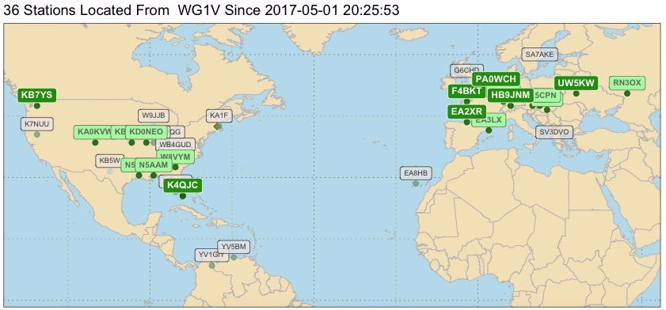
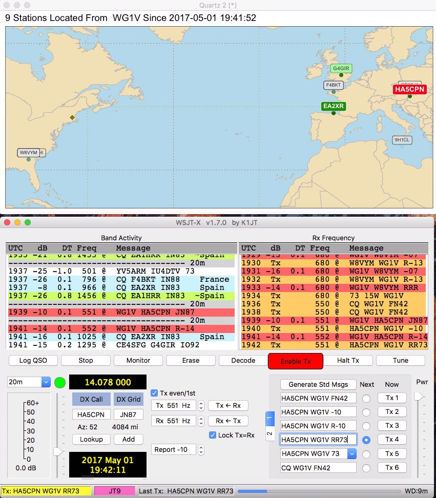

# JT-Mapper: Real-time JT65 and JT9 Maps
## Author: Carl Howe, WG1V



The development of K1JT's JT65 and JT9 protocols have reinvented digital ham radio. Thanks to Joe's and the efforts of other developers of the `WSJT-X` software program, hams now can work the world with modest transceivers and a computer with an audio card.

`WSJT-X` not only offers new radio modes to hams, but it provides a  software platform to better understand our radio environment. When we look at the WSJT-X's Band Activity display, we see information that we don't typically have in other modes, including:

* **Standardized exchanges**. Unlike the free text modes such as PSK31 or RTTY, JT65 and JT9 QSOs are highly formal exchanges and can easily be decoded by machine.
* **Multiple signal decoding**. Instead of being limited to our own QSOs, we can hear and understand multiple QSOs in progress.
* **Locations in machine readable form**. Unlike more free-form city and country descriptions, JT9 and JT65 include standard four digit grid square locations in their formal QSO exchanges.
* **Continuous logging**. Every transmitted and received sequence is logged in a file, making it easy for other programs to use information that WSJT-X collects.

During my operating with JT65 and JT9 for about 9 months now, I've found myself constantly looking up grid squares while trying to get a sense of the band's propagation. With all this information already in my computer, I decided that my computer could do more to visualize my radio environment. 

## JT-Mapper: Real-time WSJT-X Exchange Mapping
It's easier to show what the program does than to describe it. Here's a screen shot of the mapper in action:



The mapper is running in the window at the top of the screen. The standard WSJT-X Band Activity display is at the bottom.

`JT-mapper` works very simply. The mapper looks at the last 50 transmissions that WSJT-X has heard (the number 50 is can be configured to your taste). It then displays a map of the stations it has heard during this time. The map is automatically scaled to include just those stations.

In the screen shot shown above, I'm currently engaged in a JT9 exchange with HA5CPN in Hungary, whose call sign is shown in red. While I've been engaged in that QSO, I can also see that EA2XR called CQ during the minute that HA5CPN was responding, as shown by its dark green tag. Meanwhile, G4GIR has been heard communicating with some other station, as shown by the light green marker. Finally, I can see that 9H1CL in Malta and F4BKT in France have been heard earlier on the band, as indicated by their white backgrounds. 

By automatically showing you where the stations you can hear are, `JT-Mapper` gives you an overview of all the stations currently being heard within your transceiver's passband and where they are. The color codes also reflect the progress each station has made through their standardized QSO, allowing you to target new QSOs when they've completed their exchange.

Here are the callsign tags and their colors in table form:

| Icon  | Meaning  |
|:---:|---|
|   | Station called your callsign within the last minute |
|   |  Station called CQ within the last minute |
|   | Station was heard in QSO with another station within last minute  |
|  | Station was heard and located more than a minute ago  |

For stations heard over a minute ago, their callsigns and location dots get fainter the older they are.

Note that if you use a different color scheme for coloring your WSJT-X responses than I do (and you probably do), you can change the colors in `JT-Mapper` to match your palette by changing the variables `callingcolor`, `cqcolor`, `heardcolor`, and `oldcolor`. All of those variables are defined on the first page of the program.

## Running JT-Mapper
### My Ham Environment
My station is modest. My rig is an old Icom 706MKIIg HF-VHF-UHF transceiver that feeds an off-center fed dipole. The computer I use is a Mac mini running Mac OS X 10.12.4. It connects to the rig through a Signalink USB audio interface.

While `JT-Mapper` was designed for Mac OS X, it should run on Linux machines with only parameter changes and one comment change. Running on Windows would require a bit more tweaking, largely to work around the lack of a `tail` command to examine the ALL.TXT file.

#### On Linux and Mac OS X
Before you can run JT-Mapper, you need to install the R programming environment and a collection of packages for plotting and data manipulation. Fortunately, all of these are open source and readily available.

To install R, simply download the appropriate R installer for your platform from `r-project.org` and run that installer. That will provide you with a base R install. You do not need the optional developer modules.

You invoke R by typing R at your command shell as follows (don't type the % sign -- it's only there to indicate you are typing at a shell):

```
% R
```
You should see something like the following:

```
R version 3.3.2 (2016-10-31) -- "Sincere Pumpkin Patch"
Copyright (C) 2016 The R Foundation for Statistical Computing
Platform: x86_64-apple-darwin13.4.0 (64-bit)

R is free software and comes with ABSOLUTELY NO WARRANTY.
You are welcome to redistribute it under certain conditions.
Type 'license()' or 'licence()' for distribution details.

  Natural language support but running in an English locale

R is a collaborative project with many contributors.
Type 'contributors()' for more information and
'citation()' on how to cite R or R packages in publications.

Type 'demo()' for some demos, 'help()' for on-line help, or
'help.start()' for an HTML browser interface to help.
Type 'q()' to quit R.

> 
```

Once you have R installed, you need to download several external libraries from within R. You can load them all at once by typing the following at the R command prompt (again, don't type the >; that's R's command prompt):

```
> pkgs <- c('readr', 'stringr', 'sp', 'rgdal', 'ggplot2', 
          'ggmap', 'maptools', 'lubridate', 'rworldmap', 'dplyr', dependencies=TRUE).
> install.packages(pkgs)
> quit()
```
Once you have all the packages installed, you'll need to modify the first line of `JT-Mapper.R` to point to the location of Rscript on your machine. On my Mac, it's in /usr/local/bin, so my first line reads:

```
#!/usr/local/bin/Rscript
```

On your system, it might be in /usr/bin or in /var/local/bin. You can find out where Rscript lives by typing the following at the shell prompt

```
% which Rscript
```

Once you've made that small change to `JT-Mapper.R`, type the following steps at your shell command line:

```
% chmod 755 ./JT-Mapper.R
% ./JT-Mapper.R number-of-lines your-call-sign your-grid
```

If you don't include a number of lines, the number of lines will default to 50. If you don't type in a callsign and grid, JT-Mapper will use default variables values in the program, namely my callsign (WG1V) and my grid location (FN42). To make JT-Mapper always use your callsign and grid locator, open a text editor (TextEdit works well on Mac OS X), and change the variables `mycall` and `mygrid`.

Once you have `wsjtxlines`, `mycall`, and `mygrid` set properly in the program itself, all you need to do to run JT-Mapper is type:

```
% ./JT-Mapper.R
```
At present, the program doesn't remember those values between runs unless you change the variables in the program itself.

#### Modification for Linux
To run `JT-Mapper` on Linux, you must modify the `new_window` function at the top of the file. Simply comment out the line that begins with `quartz` and replace it with the currently commented line that starts with `x11`. The change is necessary because of the different R functions used in the two operating systems create a new window for the map.

#### Windows Is Not Yet Supported
Unfortunately `JT-Mapper` doesn't yet run on Windows. As noted below, the program uses the `tail` utility to read the last 50 lines of the `WSJT-X` ALL.TXT file. To run on Windows, I should probably change that code to use a function that performs the same function in R. Clearly I haven't gotten around to that yet.

## How the Software Works
JT-Mapper is written in R, a high-level language typically used by data scientists for its analytical and visualization capabilities. While I developed this software on Mac OS X, it can be run on Windows and Linux as well just by tweaking some of the variables at the beginning of the program.

The basic operation of the program is a simple 5 step process:

1. Wait until the 52 second mark of each minute.
2. At 52 seconds past the minute, run the `tail` utility read the last 50 lines of the ALL.TXT file written by the WSJT-X program. On Macs, this is kept in `/Users/username/Library/Application Support/WSJT-X/`. On other operating systems it is in a different place; you can adjust the location by changing the variable `loglocation`. You can also adjust the number of lines the program reads by adding a first argument on the command line or by changing the variable `wsjtxlines`.
3. Find all the transmissions that have a grid locator at the end of the line, and convert that to a longitude and latitude.
4. For all the transmissions that don't have a grid locator in them, see if the sending callsign has sent a grid locator in the last 50 lines and use that location instead.
5. Categorize the label for the call by whether the transmission occurred within the last minute and whether it contained our call or a CQ.

Much of the complexity of the program comes from trying to properly scale the map to include all the stations heard while not plotting too much or trying to scale the map past 180 degrees of longitude and 90 degrees of latitude. The current code is not optimal or even particularly well-structured, but it works and I'm sticking with it until I rewrite all the mapping code to use better maps and real projections.

## Issues, Bugs, and Challenges
I wrote this program to satisfy my own JT65 and JT9 operating interests and needs. As such, it is very much a work in progress and has many shortcomings. To prevent others from being surprised, here's a quick rundown of things that the program doesn't do well:

* **Handing midnight GMT**: When midnight GMT comes, the program doesn't recognize and categorize new transmissions correctly until older sequences aren't in the list of last 50 transmissions. This is because it sorts the list according to just GMT time, not time and date.
* **Handling long and unusual callsigns**: The program callsign parser is pretty ad-hoc, and doesn't really understand extended callsigns. It muddles through, but it could do better.
* **Overplotting**: If you hear many calls at once, they by necessity will overwrite each other on the map. You can reduce this by reducing the number of lines of log you process each run, but the program doesn't make any effort to avoid the issue.
* **The map isn't a proper projection**: R is happy to do map projections, but doing them with a high resolution isn't very fast. Instead of slowing down the plotting for the prettiest plot, I simply plot latitude and longitude using a rectangular grid. As a result, many of the countries and continents are distorted from their actual shapes and areas.
* **The program doesn't decode WSPR yet** . `JT-Mapper` will currently map anything it sees in the your ALL.TXT log that it recognizes, but WSPR transmissions are logged in a different file, and I'd like to color code and facet the maps according to band. That's a future project.

I'm sure there are many more bugs; feel free to clone this repository and fix issues that bother you. And by all means, let me know if you modify the code to do nifty new things or to work better on other platforms. I can be reached at:

wg1v@carlhowe.com
